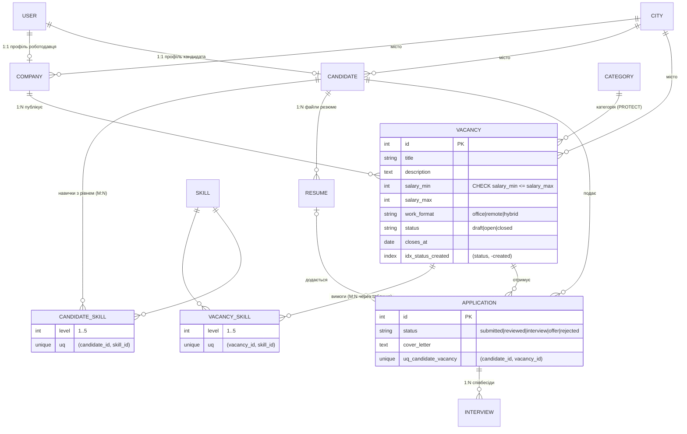

# ER-діаграма Django-застосунку (PostgreSQL `hirehub_django`)

```mermaid
erDiagram
    USER ||--o| COMPANY : "1:1 профіль роботодавця"
    USER ||--o| CANDIDATE : "1:1 профіль кандидата"
    CITY ||--o{ COMPANY : "місто"
    CITY ||--o{ CANDIDATE : "місто"
    CITY ||--o{ VACANCY : "місто"
    CATEGORY ||--o{ VACANCY : "категорія (PROTECT)"
    COMPANY ||--o{ VACANCY : "1:N публікує"
    VACANCY ||--o{ VACANCY_SKILL : "вимоги (M:N через таблицю)"
    SKILL ||--o{ VACANCY_SKILL : ""
    CANDIDATE ||--o{ CANDIDATE_SKILL : "навички з рівнем (M:N)"
    SKILL ||--o{ CANDIDATE_SKILL : ""
    CANDIDATE ||--o{ RESUME : "1:N файли резюме"
    CANDIDATE ||--o{ APPLICATION : "подає"
    VACANCY ||--o{ APPLICATION : "отримує"
    RESUME |o--o{ APPLICATION : "додається"
    APPLICATION ||--o{ INTERVIEW : "1:N співбесіди"

    VACANCY {
        int id PK
        string title
        text description
        int salary_min "CHECK salary_min <= salary_max"
        int salary_max
        string work_format "office|remote|hybrid"
        string status "draft|open|closed"
        date closes_at
        index idx_status_created "(status, -created)"
    }
    APPLICATION {
        int id PK
        string status "submitted|reviewed|interview|offer|rejected"
        text cover_letter
        unique uq_candidate_vacancy "(candidate_id, vacancy_id)"
    }
    VACANCY_SKILL {
        int level "1..5"
        unique uq "(vacancy_id, skill_id)"
    }
    CANDIDATE_SKILL {
        int level "1..5"
        unique uq "(candidate_id, skill_id)"
    }
```

**Групи й ролі:** `Candidate`, `Employer` (Django Groups + дозволи `jobs.*`), адміністратор — `is_superuser`.
